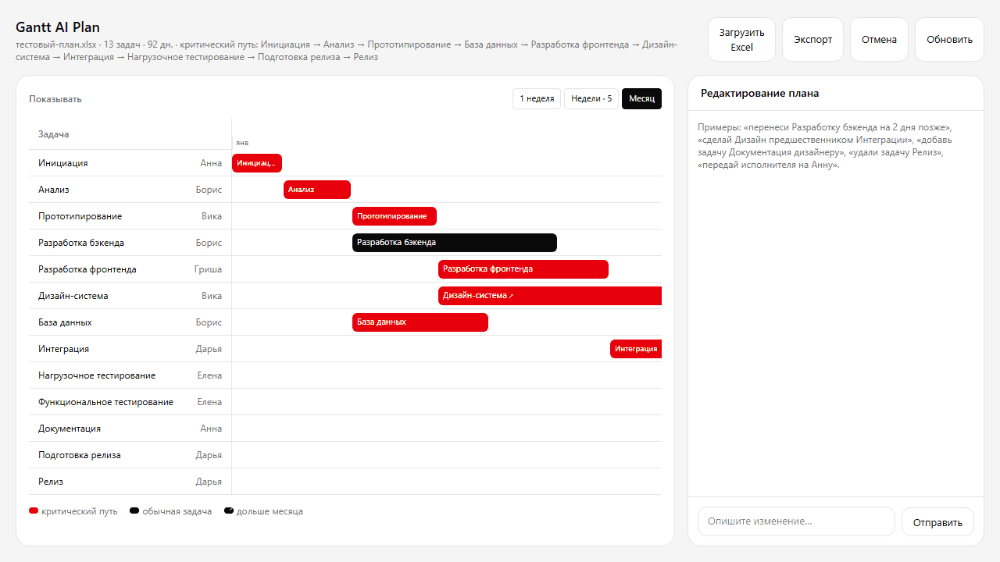

# Gantt AI Plan — AI-native редактор проектного плана

Тестовое задание: **Full-stack разработчик AI-native продукта (React + FastAPI)**.

AI-native планировщик: интерактивная **диаграмма Ганта**, которую можно править на
естественном русском языке через чат — ассистент переносит задачи, меняет
зависимости, добавляет и удаляет задачи, перераспределяет исполнителей, а
изменения **мгновенно** отражаются на диаграмме. План можно загрузить из Excel и
экспортировать обратно.

---

## Демо

| Сценарий | Статус |
|---|---|
| Демо-ссылка | `_заполняется после деплоя_` (нужен ремоут/VM) |
| Демо-видео/gif | `docs/demo.gif` |
| Пример Excel | [`samples/example.xlsx`](samples/example.xlsx) |
| Дорожная карта → продукта | [`ROADMAP_TO_PRODUCTION.md`](ROADMAP_TO_PRODUCTION.md) |



---

## Запуск

### Локально (бэкенд + фронтенд дев-сервер)

Требования: Python ≥ 3.12, Node ≥ 20.

```bash
# 1) Backend (порт 8000)
cd backend
python -m venv .venv
source .venv/bin/activate        # Windows: .venv\Scripts\activate
pip install -r requirements.txt
uvicorn app.main:app --reload    # http://localhost:8000

# 2) Frontend (Vite dev, проксирует /api на 8000) — в отдельном терминале
cd frontend
npm install
npm run dev                      # http://localhost:5173
```

Откройте [http://localhost:5173](http://localhost:5173) — увидите Гант с
закешированным стартовым планом (13 задач, ~3 месяца — включает задачи длиннее
месяца). Без `LLM_API_KEY` ассистент работает на детерминированном парсере
(см. ниже).

Шкала Ганта имеет **переключатель масштаба** (шкала всегда растягивается на всю
доступную ширину панели, без «зажатия» и скролла):
- **День** — каждый день отдельной ячейкой (дни 1, 2, 3, …);
- **Неделя** — детальный просмотр одной недели (7 дней по дням), с навигацией
  «‹ ›» по неделям и счётчиком «Неделя N из M · дни X–Y»;
- **Месяц** — по 30/31 дню (чётный месяц → 30, нечётный → 31).
Задачи длиннее месяца помечены значком «↗» и в тултипе «>1 мес».

### Docker Compose (прод-режим, nginx + backend)

```bash
# задёте LLM_API_KEY в окружении (опционально)
export LLM_API_KEY=...
docker compose up --build
# фронт: http://localhost:8080 (nginx раздаёт статик и проксирует /api на backend)
```

### LLM: ключ или fallback

- **Google AI Studio (бесплатный Gemini, дефолт)** — ключ из [aistudio.google.com/apikey](https://aistudio.google.com/apikey),
  модель по умолчанию `gemini/gemini-3.6-flash` (free tier, rate-limited). Достаточно задать `LLM_API_KEY`; `BASE_URL` не нужен.
- **Любой OpenAI-совместимый роутер** (OpenRouter, RouterAI и т.п.) — задайте `LLM_API_KEY`, `LLM_MODEL`,
  `BASE_URL` (например `https://routerai.ru/api/v1`); используются `litellm`.
- **Без ключа** — работает **детерминированный intent-parse®** (`llm/router.py`):
  чат-сценарий («перенеси … на N дней», «удали …», «добавь задачу …» и пр.)
  полностью работает на тестовых/демо данных. Подходит для демо и тестов.

**Развёрнутое демо:** http://95.142.46.44:8080 (фронт на 8080, бэкенд на 8001).

---

## Архитектура

```
┌──────────────┐   REST/SSE    ┌──────────────────────────────┐
│   Frontend   │◄────────────►│          Backend (FastAPI)   │
│  React 19    │               │  app/core    — model/расписа│
│  Vite 8 + TS │               │                scheduler*,  │
│  Tailwind v4 │               │                versions*,   │
│  nginx (e2e) │               │                policy*,     │
└──────────────┘               │                import/export│
                               │  app/mcp     — tools*, MCPServer (SDK 2.0)
                               │  app/llm     — router*, agent (two-pass)
                               │  app/api     — REST + SSE routes
                               │  SessionStore— in-memory (TTL 30m, LRU 200)
                               └───────────────────────────────────────┘
                     ┌────────────────────────────────────────────────┐
                     │ LLM-агент = MCP-клиент                         │
                     │   первый проход: intent (structured JSON)      │
                     │   второй проход: рус. наррация → SSE 'delta'   │
                     └────────────────────────────────────────────────┘
```

### Ключевые решения

1. **Единый процесс, in-process MCP.** Backend FastAPI + MCP-сервер (Python MCP
   SDK **2.0.0**: `MCPServer`) на одной машине; LLM-агент обращается к плану
   ТОЛЬКО через whitelist MCP-инструменты (`MCPSessionClient.call_tool`), не
   видя сырых данных всего файла. Вынос MCP в отдельный процесс не меняет контракт.
2. **Scheduler-движок** — отдельное ядро: forward pass (тополог. сортировка),
   backward pass (критический путь, CPM), детект циклов, каскадный сдвиг. Правки
   всегда прохожа через него, даты пересчитываются детерминированно. Сдвиг хранится
   `start_override` и удерживается при пересчёте (`scheduler.py`).
3. **Two-pass LLM.** Первый проход — structured output (JSON `Intent{action,
   targets, params, explanation}`), второй — стриминговая народная рус.
   наррация по SSE (`delta`). LLM не имеет «free will»: любое действие
   классифицирует `policy.py` (деструктивное/массовое → подтверждение).
4. **Policy → pending.** Деструктивные (`remove_tasks`) и массовые (`shift`/`reassign`
   на многие задачи) уходят в очередь подтверждения `pending`, единичные — сразу.
5. **Безопасность.** Whitelist-инструменты, `compute` — фикс. pandas-агрегации,
   **нет `eval`/`exec`**, Excel читается через `openpyxl data_only=True`
   (без формул и макросов), CORS ограничен origin фронта.
6. **Undo.** Снапшоты версий (cap 20) в памяти для отката (`US-10`).
7. **Двухпроходность + instant-update** через SSE (`fetch` + `ReadableStream`,
   не `EventSource`), т.к. POST-стрим сожанного чата.

### Структура репозитория

```
backend/
  app/
    core/      plan, scheduler, versions, policy, import_export, sessions
    mcp/       tools (11), server (MCPServer, SDK 2.0)
    llm/       intents, router, agent
    api/       routes (REST+SSE), state
    seed.py, main.py, config.py
    tests/     pytest (21 тестов)
  requirements.txt, Dockerfile
frontend/
  src/components/  GanttChart, TaskModal, ChatPanel, ConfirmModal, Toolbar
  src/             App, api (SSE stream), types, main
  package.json, vite.config.ts
samples/           example.xlsx (пример Excel)
docs/              REQUIREMENTS.md, ARCHITECTURE_PLAN.md, TZ_TEXT.txt, demo.gif
ROADMAP_TO_PRODUCTION.md
docker-compose.yml, Dockerfile.frontend, nginx.conf
```

### REST API (основные)

| Метод | Путь | Назначение |
|---|---|---|
| POST | `/api/session` | создать сессию с **закешированным** стартовым планом |
| GET | `/api/session/{id}` | состояние плана |
| POST | `/api/session/{id}/upload` | загрузить свой `.xlsx`/`.csv` |
| GET | `/api/export/{fmt}?session_id=` | экспорт в Excel/CSV |
| POST | `/api/chat/{id}` | чат-запрос (intent → применение → наррация) |
| GET | `/api/chat/{id}/stream` | то же, **SSE-поток** (`intent/update/delta/done/pending`) |
| POST | `/api/pending/{id}/confirm` · `/cancel` | подтвердить/отменить массовую операцию |
| POST | `/api/session/{id}/undo` | откатить последнее изменение |

Формат Excel: колонки `задача | описание | исполнитель | длительность | предшественники`.

---

## Автор

**Выполнено как тестовое задание.** Ключевые особенности разработки описаны
в `ROADMAP_TO_PRODUCTION.md` (технические долга, риски, порядок закрытия).

## Как использовались AI-ассистенты в разработке

Разработка велась в **AI-native** режиме (это и был один из аспектов задания):

- **Генерация кода.** Бэкенд (scheduler, MCP-слой, LLM-агент), фронтенд
  (React-компоненты), Docker/Compose и тесты написаны с использованием
  Claude (Claude Code, Agent SDK) в качестве ассистента.
- **Генерация по результатам.** Планирование (аналитик → архитектор →
  согласователь) и реализация (developer → devops → QA) велика через
  многоагентный конвейер: роли получали результат предыдущей и генерировали
  следующий артефакт.
- **Проверка целостности.** Автотесты, структура и соответствие ТЗ
  перепроверялись AI; часть SQL/аналитики и выходных текстов проверена вручю
  человеком.
- **Ограничения и ответственность.** OpenAI-подобные модели дают вероятный
  output. Автор проверил состав кода, тесты (21 pass), проконтролировал
  безопасность (упрощение без формул/выз по-еval) и в итоге отвечается за
  конечный результат.

*Детальный разбор AI-процессов — в `docs/` и `ARCHITECTURE_PLAN.md`.*